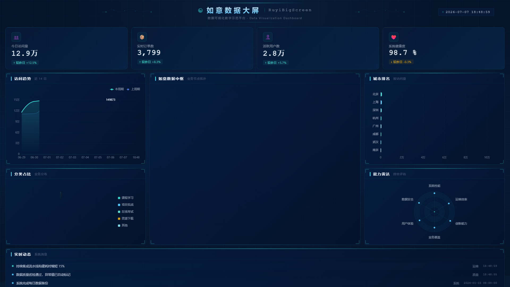

# RuyiBigScreen｜如意数据大屏

教学型数据可视化大屏项目，基于 Vue 3 + TypeScript + ECharts 构建。

适合前端学习者、数据可视化初学者、AI 辅助编程课堂案例。

## 项目预览



## 项目简介

如意数据大屏是一个从零开始搭建的前端数据可视化大屏教学项目。页面采用 1920x1080 设计稿，等比缩放自适应浏览器窗口，不需要地图数据或后端服务即可在本地运行和演示。

项目代码模块化清晰，配有单元测试和 E2E 测试，适合作为学习 Vue 3 数据大屏开发的参考。

## 核心特性

- 1920x1080 大屏布局，自适应缩放，无滚动条
- 纯前端 mock 数据，无需后端即可运行
- 模拟实时数据刷新，页面数据持续变化
- 五类 ECharts 图表：趋势线图、饼图、柱状图、雷达图、拓扑图
- 如意数据中枢拓扑图，替代传统地图方案
- 如意国风科技蓝视觉主题
- 模块化目录结构，service 层隔离数据访问
- 统一数据源切换机制，支持 mock / api 两种模式
- 完整测试体系：Vitest 单元测试 + Playwright E2E 测试
- 代码质量工具：TypeScript 严格模式、ESLint、Prettier、Stylelint

## 技术栈

| 类别 | 工具 |
|------|------|
| 前端框架 | Vue 3 (Composition API + `<script setup>`) |
| 构建工具 | Vite |
| 编程语言 | TypeScript（严格模式） |
| 图表库 | ECharts + vue-echarts |
| 状态管理 | Pinia |
| HTTP 客户端 | Axios |
| Mock 方案 | MSW（Mock Service Worker） |
| 单元测试 | Vitest + @vue/test-utils + jsdom |
| E2E 测试 | Playwright |
| 代码规范 | ESLint + Prettier + Stylelint |
| 样式 | SCSS |

## 页面内容

大屏页面划分为六个区域：

- **顶部标题与时间**：页面标题、副标题、实时时钟
- **核心指标卡片**：今日访问量、实时订单数、活跃用户数、系统健康度
- **访问趋势（折线图）**：近 14 日访问量趋势对比
- **分类占比（饼图）**：业务分类分布占比
- **如意数据中枢（拓扑图）**：中心枢纽节点 + 周边业务节点的拓扑关系图，带动态流线和脉冲光效
- **城市访问排名（柱状图）**：主要城市访问量排行
- **能力雷达模型（雷达图）**：系统在各维度的能力评估
- **实时动态与告警**：底部滚动消息列表，展示系统事件

## 实时数据模拟

项目在 mock 模式下，通过 `src/mocks/realtimeDashboardSimulator.ts` 模拟真实业务系统的数据持续刷新：

- 顶部指标每 2 秒变化一次（访问量递增、订单波动、活跃用户微调）
- 趋势图每 6 秒追加新时间点，滑动窗口保留最近 10 个点
- 实时动态每 4~6 秒新增一条消息，保留最近 8 条
- 数据中枢节点 value 小幅波动，status 按阈值自动变化
- 城市排名每 8 秒更新排序
- 分类占比每 10 秒归一化调整
- 雷达图每 30 秒低频微调

所有变化均为前端模拟，不涉及真实后端。

## 项目结构

```
RuyiBigScreen/
├── scripts/
│   └── capture-dashboard.mjs    # 自动化截图脚本
├── docs/
│   └── screenshots/             # 项目展示截图
├── public/
│   ├── favicon.svg
│   └── mockServiceWorker.js     # MSW Service Worker
├── src/
│   ├── assets/styles/           # 全局样式
│   ├── charts/                  # ECharts 图表组件
│   ├── components/              # 通用 UI 组件
│   ├── layouts/                 # 大屏布局组件
│   ├── views/                   # 页面视图
│   ├── services/                # 数据访问层
│   ├── stores/                  # Pinia 状态管理
│   ├── mocks/                   # MSW mock + 实时模拟器
│   ├── types/                   # TypeScript 类型定义
│   ├── utils/                   # 工具函数
│   ├── logs/                    # 日志系统
│   └── tests/                   # 测试
│       ├── unit/                # 单元测试
│       └── e2e/                 # E2E 测试
├── .env                         # 环境变量（默认 mock）
├── vite.config.ts
├── vitest.config.ts
├── playwright.config.ts
└── eslint.config.js
```

## 快速开始

### 环境要求

- Node.js >= 18
- npm >= 9

### 安装依赖

```bash
npm install
```

### 启动开发服务

```bash
npm run dev -- --host 127.0.0.1 --port 10001
```

### 访问页面

```
http://127.0.0.1:10001/
```

## 常用命令

| 命令 | 说明 |
|------|------|
| `npm run dev` | 启动本地开发服务（默认 10001 端口） |
| `npm run build` | TypeScript 类型检查 + 生产构建 |
| `npm run preview` | 预览构建产物 |
| `npm run lint` | ESLint 检查并自动修复 |
| `npm run format` | Prettier 格式化源码 |
| `npm run lint:style` | Stylelint 检查样式文件 |
| `npm run test` | 运行 Vitest 单元测试 |
| `npm run test:watch` | 监听模式运行单元测试 |
| `npm run test:e2e` | 运行 Playwright E2E 测试 |
| `npm run test:e2e:ui` | 有头模式运行 E2E 测试 |
| `npm run screenshot` | 自动截取大屏全图 |

## 数据源说明

项目默认使用 mock 数据模式，所有数据由 MSW 在前端拦截请求后返回模拟数据，无需后端服务。

通过环境变量切换数据源：

```bash
# 当前模式（默认）：使用 MSW mock 数据
VITE_DATA_SOURCE=mock

# 切换到真实 API 模式（需后端配合）
VITE_DATA_SOURCE=api
VITE_API_BASE_URL=/api
```

环境变量在 `.env` 文件中配置。数据访问统一通过 `src/services/` 层，组件不直接读取 mock 文件，切换到真实 API 时只需修改环境变量，无需改动业务代码。

## 自动化截图

一键截取大屏全图，用于项目展示和文档引用：

```bash
npm run screenshot
```

截图输出：

```
docs/screenshots/dashboard-1920x1080.png
```

截图参数：

- 视口尺寸：1920x1080
- 等待指标卡片、ECharts 图表、如意数据中枢全部渲染后截图
- 等待实时数据至少刷新一轮（约 5 秒）
- 检测浏览器控制台错误并报告

## 测试与质量保障

- **TypeScript 严格模式**：全程类型检查
- **ESLint**：JavaScript / TypeScript / Vue 代码规范
- **Prettier**：统一的代码格式化
- **Stylelint**：SCSS 样式规范
- **Vitest 单元测试**：31 个测试用例覆盖工具函数、数据服务和实时模拟器
- **Playwright E2E 测试**：7 个场景覆盖页面渲染、图表展示、实时刷新稳定性
- **生产构建验证**：`build` 命令包含 TypeScript 类型检查和 Vite 构建

## 适合学习什么

- Vue 3 组合式 API 和 `<script setup>` 项目结构
- 1920x1080 数据大屏的自适应布局方案
- ECharts 图表组件封装与配置
- MSW 前端 Mock 和 service 层数据隔离
- Pinia 状态管理和实时刷新控制
- Vitest + Playwright 测试编写
- 模块化目录设计
- 自动化截图与项目展示

## 后续计划

- [ ] 接入真实后端 API
- [ ] 增加更多图表组件（热力图、桑基图等）
- [ ] 增加主题切换（如浅色模式）
- [ ] 增加视觉回归测试
- [ ] 增加 Docker / Vercel 部署示例

## License

MIT
